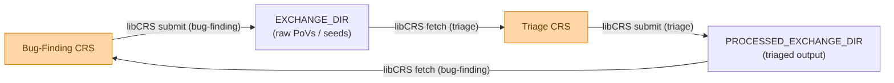

# Meeting Notes

OpenSSF Cyber Reasoning Systems Special Interest Group

---

## Agenda

1. CRSBench Paper
2. Triage Mode

---

## CRSBench Paper

Paper covering the CRSBench evaluation framework is **submitted to ACM CCS**.

- Benchmarks for evaluating CRS bug-finding and bug-fixing capabilities
- Fully compatible with CRS in OSS-CRS
- Resource management (LLM budget, compute constraints) for fair evaluation
- Benchmarks are mix of AIxCC and Team Atlanta written challenges

---

## Triage Mode

A new CRS mode has been added to OSS-CRS for **crash triage** and **seed filtering**.

- Consumes PoVs / seeds produced by bug-finding CRSs
- Deduplicates and clusters crashes
- Produces structured triage reports for downstream patching
- Cleaner handoff between bug-finding and bug-fixing pipelines

---

## Triage Mode: Seed / PoV Flow

---

## Q&A / Discussion

Refer to Cyber Reasoning Systems bi-weekly meeting notes.
